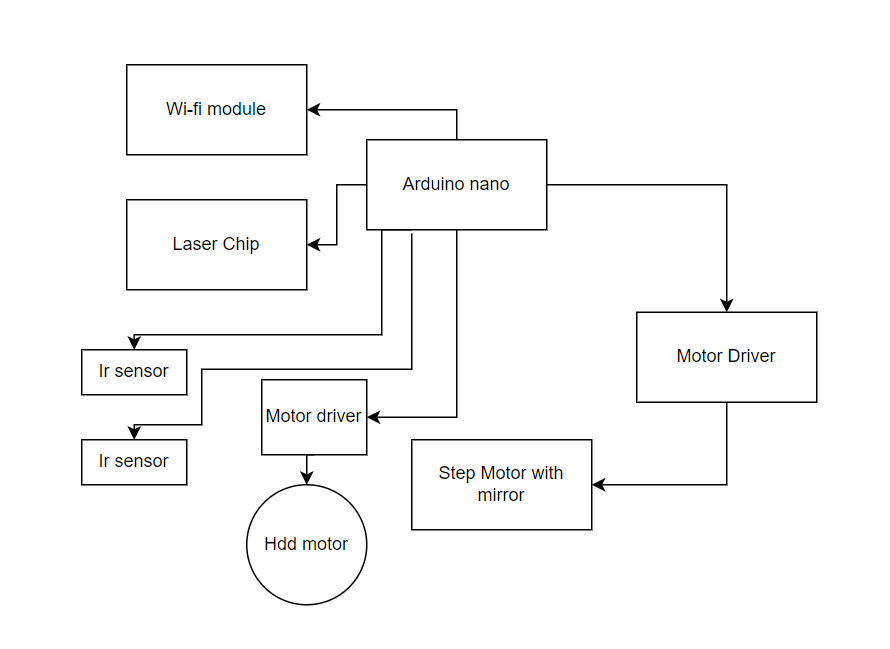

## Компоненты

1. Arduino nano

2. HDD motor

3. Motor driver - Плата контроллера бесщеточного двигателя постоянного тока 5 в 12 В с защитой от перегрузки по току и обратного напряжения для двигателя жесткого диска

4. Wi-fi module

5. Laser Chip

6. Ir sensor -- Модуль инфракрасного датчика скорости, датчик расстояния, оптрон для Arduino Smart Car/Robot

7. DAC mcp4822

8. Motor with mirror

